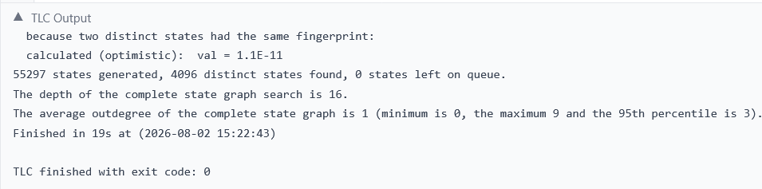
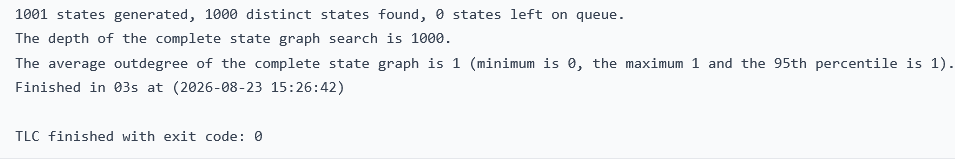
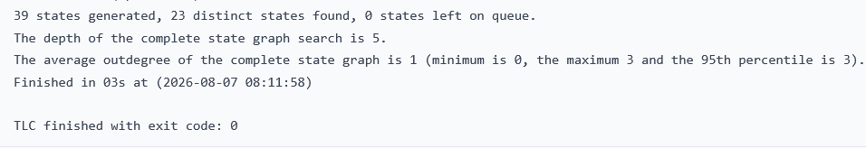
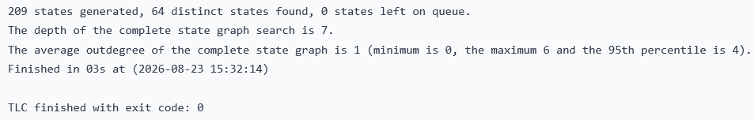
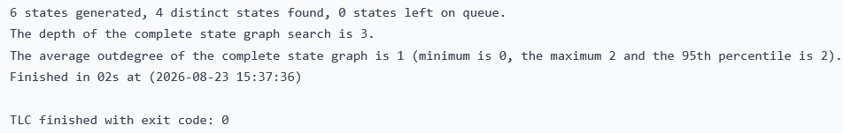

# Reg-HRABAC Enterprise Registries - Formal Verification Suite (TLA+)

This repository contains the formal specifications and verification models for the **Deterministic Hybrid Role and Attribute Based Access Control (HRABAC)** framework, designed for secure, high-performance, and GDPR-compliant national public registries using blockchain technology.

The system mechanics and algorithmic boundaries are mathematically operationalized and proven resilient against adversarial exploits utilizing **TLA+** and the **TLC Model Checker**.

---

## 🏗️ Repository Architecture

The formal verification suite is structured into five independent TLA+ modules, each testing a critical runtime invariant specified in the underlying research paper:

```text
├── MODULE Source_Authenticity   # Verifies Invariant 1: Multi-sig consortium validation bounds.
├── MODULE Gas_Predictability    # Verifies Invariant 2: Constant-time O(1) gas cost ceiling.
├── MODULE Recovery              # Verifies Invariant 3: O(1) failover & cold start recovery path.
├── MODULE GDPR_Compliance       # Verifies Invariant 4: Cryptographic shredding & orphan state.
└── MODULE Epoch_Revocation      # Verifies Invariant 5: Constant-time dynamic batch atomicity & short-circuit execution.
```

---

## 🔒 Formally Verified System Invariants

### 1. Invariant 1: Source Authenticity & Consortium Consensus
* **Objective:** Guarantees that any state transition on the public ledger must map back to an authentic, uncompromised subset of sorted consortium nodes, neutralizing signature malleability and replay injections.
The result is as follows:


### 2. Invariant 2: Constant Complexity & Gas Predictability
* **Objective:** Mathematically operationalizes the claim that the partial derivative of transaction gas overhead relative to database depth is exactly zero ($\frac{\partial(\text{Gas})}{\partial N} = 0$). It proves immunity against scale-induced Block Gas Limit DoS attacks by locking validation costs at a static **29,334 gas units**.


### 3. Invariant 3: Failover & Decentralized State Recovery
* **Objective:** Verifies that the synchronization and state restoration latency for hot-standby passive shadow nodes during local corruption is strictly bounded to a constant temporal window ($\Delta t \le c$) by direct indexation of anchored on-chain epoch roots, mitigating the Cold Start Paradox.


### 4. Invariant 4: GDPR Compliance & Mathematical Orphans
* **Objective:** Proves that upon the structural execution of a Right-to-Erasure directive (GDPR Article 17) at the off-chain layer, the corresponding immutable on-chain cryptographic footprint irreversibly transforms into an un-linkable, strongly anonymized *mathematical orphan*.


### 5. Invariant 5: Constant-Time Dynamic Batch Revocation Atomicity
* **Objective:** Mathematically proves the transactional atomicity of multi-credential consensus revocations ($\mathcal{O}(1)$ complexity scaling profile). It demonstrates that altering a solitary on-chain cryptographic epoch root flag instantaneously short-circuits validation vectors for an entire batch of size $M$, eliminating the requirement for resource-intensive iterative dynamic loops and mitigating network exhaustion vectors.


---

## 🚀 Execution & Model Checking Instructions

### Prerequisites
* **TLA+ Toolbox** (v1.7.1 or higher) OR the **TLC Command Line Evaluator** via Java runtime.

---

## 📊 Evaluation & Verification Summary
All core invariants successfully terminate with `exit code: 0` and zero safety or liveness anomalies detected. The structural conversion of semantic HRABAC logic into low-level key-value mappings successfully decouples enterprise runtime execution layers from volume-induced linear degradation.
